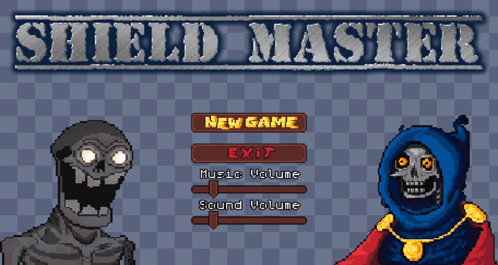

# **Shield Master**

Shield Master is an action-packed 2D game built using Java and the LibGDX framework. Rotate your shield to block incoming projectiles, score points, and survive as long as you can!

## **Controls**
- **Arrow Keys / WASD Keys:** Rotate the shield in four directions (Up, Down, Left, Right).
- **Escape Key:** Pause or unpause the game.
- **Mouse:** Navigate through buttons and sliders in the UI.

---

## **Installation**

To set up the project, follow these steps:

1. Clone the repository:
    ```sh
    git clone https://github.com/Trototoo/ShieldMaster.git
    cd ShieldMaster
    ```

2. Ensure you have Java 17 installed.

3. Build the project using Gradle:
    ```sh
    ./gradlew build
    ```

## Usage

To run the game, use the following command:
```sh
./gradlew lwjgl3:run
```

---

## Game Preview

## [Gameplay on YouTube](https://youtu.be/8mxuCmyJkhc)

---

## Credits

Made by Nazarenko Oleksandr IM-12
